# **My Second Project**

## **Project Title**
### *Noughts and Crosses*
***
## Live Site

[Noughts and Crosses](https://dsp1994.github.io/Noughts-and-Crosses/)

## Repository

[https://github.com/DSP1994/Noughts-and-Crosses](https://github.com/DSP1994/Noughts-and-Crosses)

## Table of content

- [Purpose](#Purpose)
- [Brief](#Brief)
- [Including](#What-I-entend-to-include)
- [Responsive Website](#Responsive-Website)
- [Beginning The Project](#Beginning-The-Project)
  - [Main page](#main-page)
  - [Initial Idea](#Initial-Idea)
  - [Color Scheme](#Color-Scheme)
  - [Typography](#Typography)
  - [X and O](#x-and-o)
- [During The Project](#During-The-Project)
  - [Features On The Site](#Features-On-The-Site)
  - [Technology Used](#Technology-Used)
- [Completion Of The Website](#Completion-Of-The-Website)
  - [What Else](#What-Else?)
  - [Testing](#Testing)
  - [Bugs](#Bugs)
  - [Personal Difficulties](#Personal-Difficulties)
  - [Deployment](#Deployment)
- [Credits](#Credits)
***
## **Purpose**

This website has been designed for the purpose of my second project with the code institute course. It is an interactive front end website, using basic JavaScript code, which allows the user to recieve feedback from the website. It also includes basic HTML and CSS. A list of technologies used can be found in the '[Technology Used](#Technology-Used)' section of this Readme.md.

I found myself struggling with this section of the course, due to an overload of stress at my current work, so I used a template guide to assist me in making this website. All credits can be found in the [Credits](#Credits) section of this Readme.md file.
***
## Brief

The end goal of this website, was to produce an interactive website where two users could play against one another in a simple game of noughts and crosses. Whether a win, loss, or draw, the users will have feedback from the website, regarding each outcome.
***
### **What I entend to include;**

- A grid on which users can click on.
- An outcome for; win, loss or draw.
- A restart button instead of refreshing the page.
***

### Responsive Website
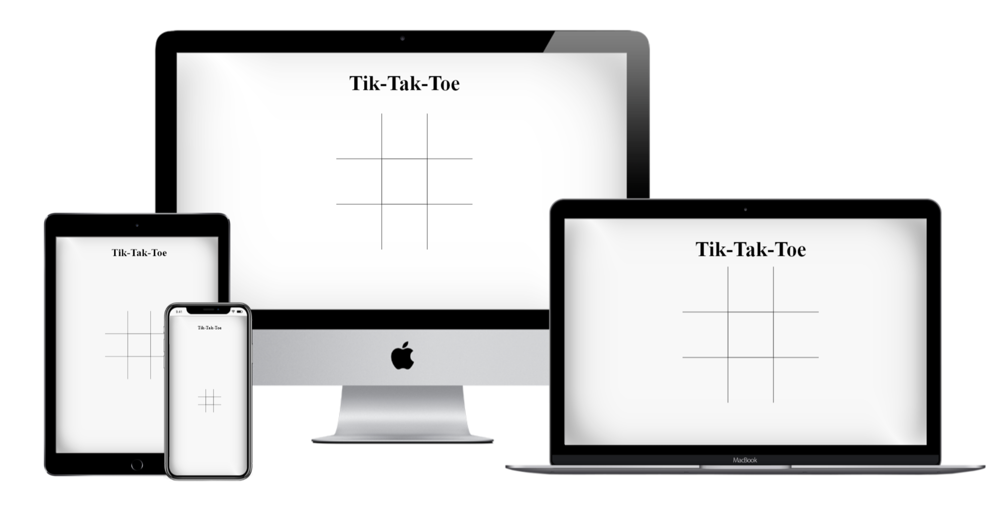
***
## **Beginning The Project**
### **Initial Idea**
As mentioned above, I found JavaScript quite challenging to wrap my head around. There is so much to learn in such a short space of time, I found myself constantly struggling to find an original idea where I could write my own code. So I took to my mentor to ask for some advice, and he mentioned a number of different ideas from which I could find help hints online on how to create an interactive website. The one I decided to go with was a simple Noughts and Crosses (or as American's call it, tik tac toe (which I will abbreviate to T.T.T. for simplicity for the rest of the readme.md file)). I thought this would be a great start to help my understanding of JavaScript develop further. In my previous project, I found myself becoming bogged down in the tiniest details, which took away valuable time from the project, so for this one I decided that I would make it minimalistic and much simpler for myself.
***

### **Main Page**
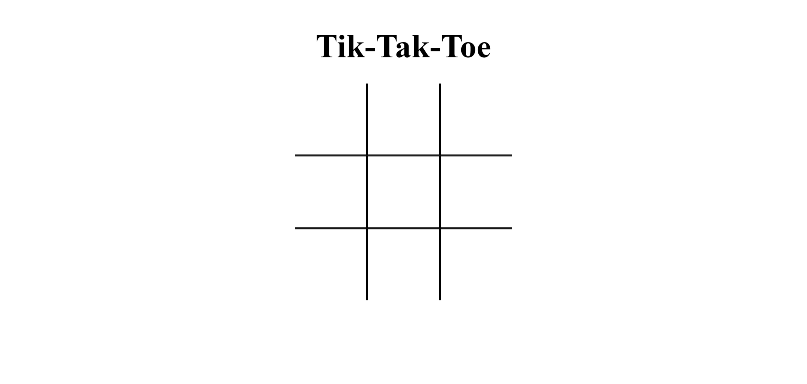
***

### **Colour Scheme**
Unlike my previous project, I decided it was best to follow the guide and leave this website as black and white. White background, black text/grid. If it ain't broke, don't fix it!
***

### **Typography**
Sans-serif has been used for this website. Simple, basic text. No outside source was needed.
***

### **X and O**
The X and O that can be found when clicking on the individual grids, have been sourced from the guide I used. There is no fancy text, or design to these, they've simply been copied and pasted in to save on a few extra lines of code.

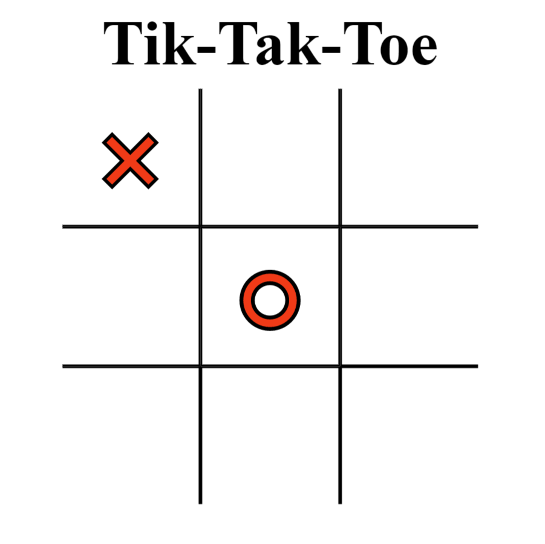
***

## **During The Project**
### **Features on the site**
Just like the previous project, by planning out my ideas previously in the '[What I Intend To Include](#What-I-Intend-To-Include)' section, I was able to be more effecient throughout designing the site.

> A grid on which users can click on.
  * By using 'divs' I was able to set up a 3 by 3 area which is used in the traditional game of TTT. Then using the ':nth-child', I was able to remove the sides of the grid I did not need to produce a usable grid area.
  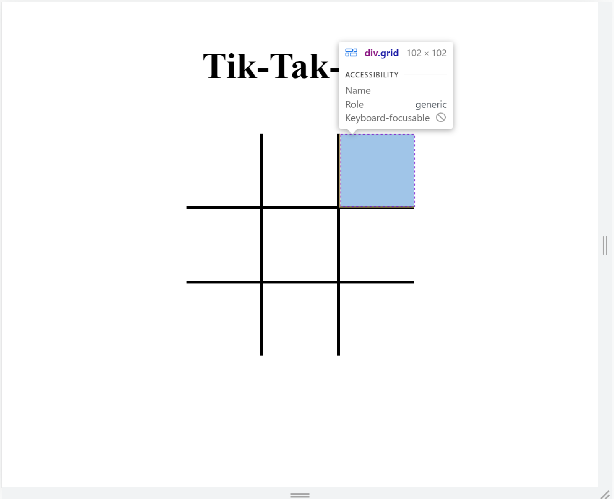
  ***
> An outcome for; win, loss or draw.
  * It wouldn't be much of a game if no one knew who won! So either once all the divs are full, or a specific 'winningState', has been met, a message appears on the screen which informs the users of the outcome.
  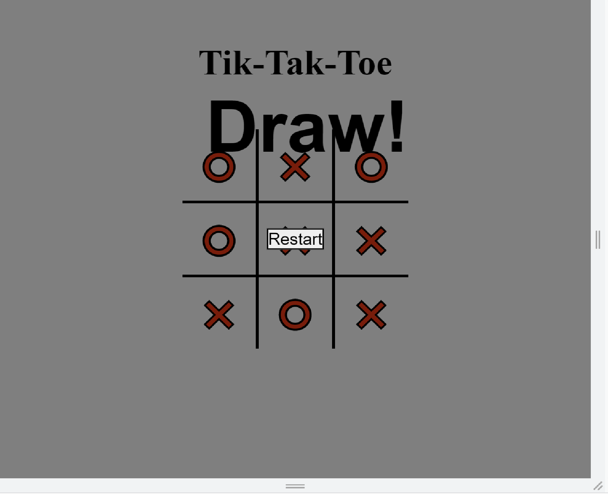
  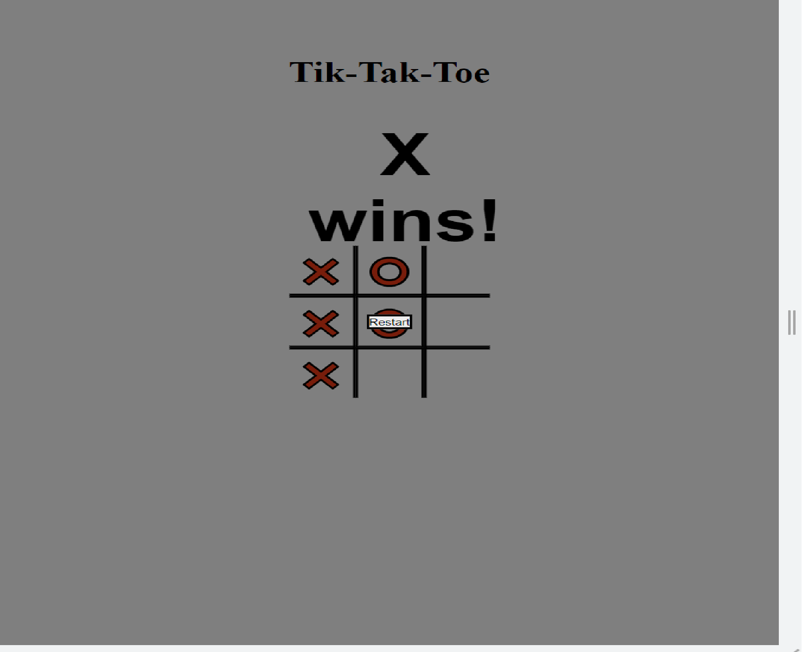
  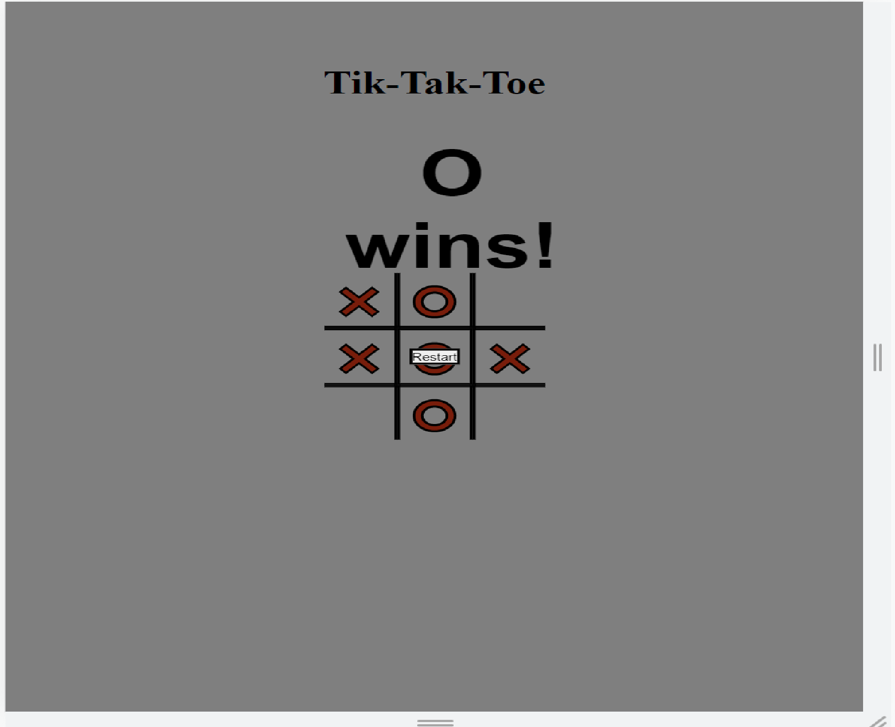
  ***
> A restart button instead of refreshing the page.
  * Once the game is completed, a restart button is needed to reset the divs to their original states, to allow the users to either keep beating their friend, or get redemption!
***

### **Technologies Used**
- [Chrome Dev Tools](https://developer.chrome.com/docs/devtools/)
  - Even though the site is extremely basic, I still found myself using Chrome Dev Tools to position parts of the page differently, espeically when it came to making it a responsive site.

- [HTML Checker](https://validator.w3.org/)
   - I ran the code through the HTML validator to ensure that the Web page ran smoothly with the correct code.

- [CSS Checker](https://jigsaw.w3.org/css-validator/)
  - Just like the HTML Checker, this site was used to ensure that my CSS passed the correct test results.

- [JS Checker 1](https://jshint.com/)
- [JS Checker 2](https://beautifytools.com/javascript-validator.php)
  - The reason I used two different JavaScript Checkers, was due to a couple of bugs I found in the code, which I will go into detail in the [Bugs](#Bugs) section of the readme.md file. I wanted to ensure that these bugs were indeed the same on another JS Checker.

- [Chromes Lighthouse Audit](https://web.dev/)
  - This service was used to check how my site worked in an overall capacity. The results of this, and the HTML & CSS Checkers, can be found in the [Testing](#Testing) section.
***

## **Completion Of The Website**
### **What else would I like to add?**
- I feel  like a running tally of which side won, X or O, would be a great addition to the site, this would allow users to keep track of their score on the screen. However though I tried to use the knowledge shown in the Code Institute videos, with the Love Maths code, I was unable to adapt it to my current project. Though it is definitely something I would like to try again in the future, once my skills as a developer have grown.
***

### **Testing**
Double checking code is now second nature, and using the HTML and CSS checkers, I was able to detect any issues in the code early on, and adjust as necessary. The results are below. Along with the lighthouse result, and the JS checking results.
***
### **Validators**
#### **HTML Validator**

***
#### **CSS Validator**
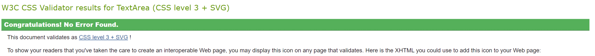
***
#### **JS Validator**
When I originally pasted the code into the checker, a large number of issues presented themselves. However, after some quick research, I was able to eliminate most of the errors. Unfortunately there is still one error remaining, but I am unsure of how to fix this. Further information can be found in the [Bugs](#Bugs) section. 
***
#### **Lighthouse**
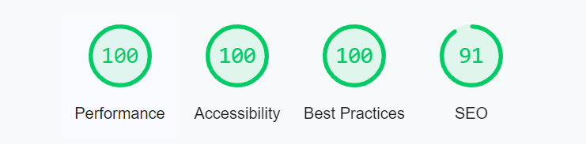
***

### **Bugs**
#### **Current**
As mentioned above, I was unsure of what could be causing so many warning messages in the orginial code. The error that kept appearing is as stated below;
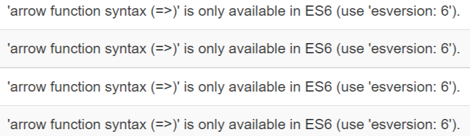

I hadn't seen this message before, so I took to google and found that by adding '/*jshint esversion: 6 */' to the top of my JS code, this error disappeared completely. I am not sure why this is, but I believe it is to do with different versions of JS.

There was also another couple of errors, which were easily fixable;
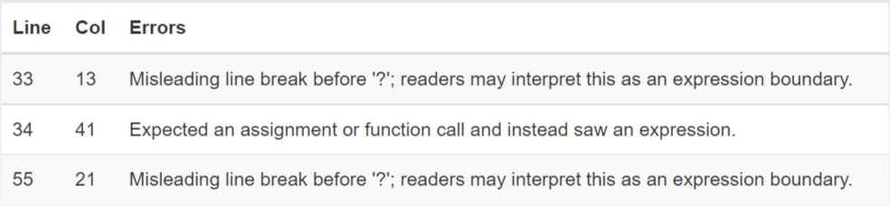

Including 'misleading line break'. In order to fix these, I simply removed the line break in the code, and this seemed to resolve the issue. Unfortunately, the middle one is still an on going issue, 'expected an assignment...expression'. I am unable to find any resolve to this line of code, but it is something I wish to work on in the future.
***

### **Personal Difficulties**

As mentioned at the beginning of the Readme.md file, I found myself struggling a lot with JavaScript, and I believe this to be because of external factors, such as my current place of employment requiring a lot of my time.
This led to me rushin through a couple of sections of the course, resulting in me not fully understanding everything I was reading. Though I am able to understand the code I am looking at, and know why it does what it does, I find myself struggling to write it from memory. 

This is why I chose to use a helpful step by step guide in the creation of this project. The credits of which will be posted down below. I really found myself enjoying following the step by step guide, as I found it easier to understand how parts of code worked by seeing it play out in front of me in real time. Just like the 'Love Maths' project. I feel like over time, I will find myself understanding and writing more of my own code without the need of a guide, but due to the sheer amount of functions and uses to JS, I know myself well enough to know when I need a little extra help.

### **Deployment**
Github allows for a very simple deployment of websites. In order to do this, please follow the steps below;

1. Open repository on Github
2. Go to settings
3. Choose pages
4. Click to "Branch" and choose "main"
5. Then click "Save"
6. Finally, click the link.

You will have to wait a number of minutes to allow the website to full generate, however this is not something I can control, as it is to do with Github.
***

## **Credits**
A huge, huge, HUGE, thank you to the creator of the step by step guide on making a TTT website. The link of which can be found here;
(https://www.webtips.dev/tic-tac-toe-in-javascript). 

### **Comments**
Without the above website, I am 100% sure I would not have completed this module. Though some code has been changed to make it easier for myself to personally understand, I couldn't have done it without them. I only hope to one day be able to repay the favour to someone else who is struggling, when I find myself confident enough in my ability to be able to do so.
***